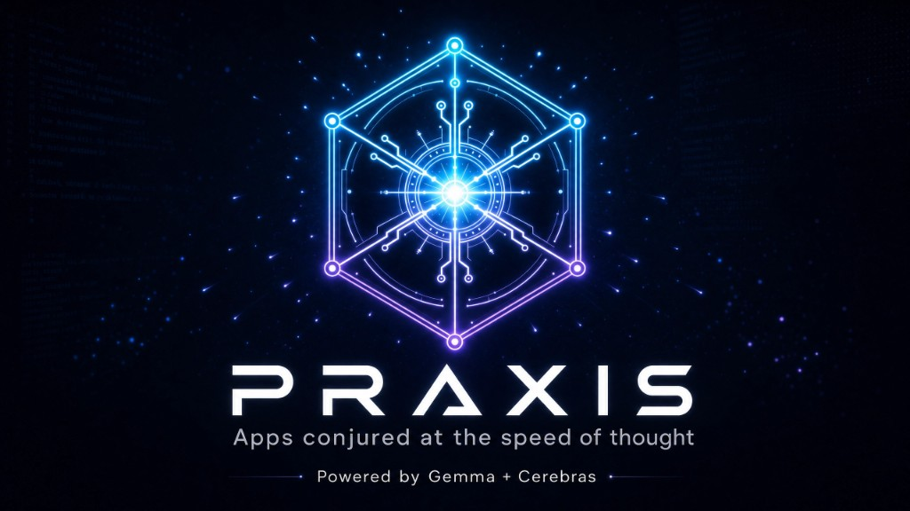
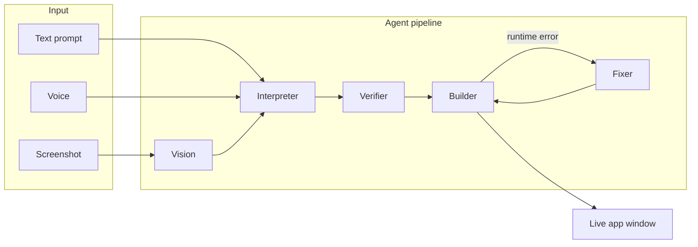

<p align="center">
  
</p>

<h1 align="center">Praxis</h1>

<p align="center">
  <strong>Apps conjured at the speed of thought.</strong><br />
  A generative operating system built for the <strong>Cerebras Gemma Hackathon</strong> — Track 1: Multiverse Agents.
</p>

<p align="center">
  
  
  
  
</p>

---

## What is Praxis?

Praxis is a full-screen **generative OS**: a desktop shell where you describe an app in natural language, speak it, or drop a screenshot — and watch a **multi-agent pipeline** build a working web app live inside a managed window.

Every generation runs on **Gemma 4 31B via Cerebras**, with HTML streamed in real time so the UI appears as it is written. A built-in **Speed Compare** panel contrasts Cerebras throughput against a slower model so the latency advantage is visible, not just claimed.

---

## Features

| | |
|---|---|
| **Multi-agent pipeline** | Vision → Interpreter → Verifier → Builder → Fixer collaborate on every generation |
| **Ultra-fast inference** | Live HTML streaming on Cerebras with build-time metrics (duration, tok/s) |
| **Speed Compare** | Side-by-side throughput: Gemma 4 31B (fast) vs Qwen 3.5 35B (slow) |
| **Multimodal input** | Drag-and-drop a screenshot → Vision agent analyzes layout before build |
| **Voice input** | Speak your app idea via the prompt bar microphone |
| **Iterative refine** | Edit generated apps in-place without starting over |
| **Sandboxed runtime** | Each app runs in an isolated `iframe` — shell and generated code stay separate |
| **Visual variety** | Automatic aesthetic rotation so repeated prompts don't produce clone UIs |

---

## How it works



1. **Vision** (optional) — describes a screenshot so the Interpreter can replicate or adapt a UI.
2. **Interpreter** — turns the request into a structured JSON app spec.
3. **Verifier** — validates the spec before code generation.
4. **Builder** — streams self-contained HTML/CSS/JS on Cerebras.
5. **Fixer** — patches layout and runtime errors when something breaks.

---

## Tech stack

| Layer | Stack |
|-------|-------|
| Frontend | React 19, Vite, TypeScript, Tailwind CSS |
| Backend | Node.js, Express |
| Inference | Gemma 4 31B on Cerebras (OpenAI-compatible API) |
| Runtime | Sandboxed `iframe srcdoc` per generated app |

---

## Quick start

### Prerequisites

- **Node.js 20+**
- A **Cerebras API key** (get one from the hackathon / Cerebras console — never commit it)

### 1. Clone and install

```bash
git clone https://github.com/xFurti/Praxis.git
cd Praxis
git checkout hackathon-core

cd server && npm install
cd ../app && npm install
```

### 2. Configure the backend

```bash
cd server
cp .env.example .env
```

Edit `server/.env` and set **only on your machine**:

```env
CEREBRAS_API_KEY=your_key_here
CEREBRAS_MODEL=gemma-4-31b
MULTIMODAL_ENABLED=true
```

> **Never** commit `.env`. Keys stay in `server/.env` only — the frontend never sees them.

### 3. Run

**Windows** — double-click `start.bat`, or manually:

```bash
# Terminal 1 — backend
cd server && npm run dev

# Terminal 2 — frontend
cd app && npm run dev
```

Open **http://localhost:5173** (API defaults to **http://localhost:3001**).

---

## Environment variables

All secrets are read server-side from `server/.env`. See `server/.env.example` for the full template.

| Variable | Required | Description |
|----------|----------|-------------|
| `CEREBRAS_API_KEY` | Yes (live demo) | Your Cerebras inference API key |
| `CEREBRAS_MODEL` | Yes | Model id, e.g. `gemma-4-31b` |
| `PORT` | No | Backend port (default `3001`) |
| `MULTIMODAL_ENABLED` | No | `true` to enable screenshot → Vision pipeline |
| `SPEED_COMPARE_*` | No | Optional overrides for Speed Compare labels/models |

Without a valid key the backend falls back to **mock** responses (useful for UI development only).

---

## Demo prompts

Try these for a hackathon walkthrough:

| Mode | Prompt |
|------|--------|
| Text | `minimal todo list with checkboxes` |
| Voice | `calcolatrice` |
| Multimodal | Attach a UI screenshot + `replica questa interfaccia` |
| Refine | `make buttons larger and improve contrast` |
| Speed | Generate any app, then open **Speed Compare** to see tok/s |

---

## Project structure

```
Praxis/
├── assets/           # Branding (banner, etc.)
├── app/              # React shell — windows, prompt bar, agent UI
│   └── src/
│       ├── shell/    # Desktop chrome, BootScreen, PromptBar
│       ├── agents/   # Agent pipeline & sprites
│       ├── runtime/  # Live generation, iframe runtime
│       └── panels/   # Speed Compare
├── server/           # Express API — model orchestration
│   └── src/
│       ├── routes/   # /api/interpret, /api/build, /api/vision, …
│       └── callModel.js
└── start.bat         # Windows one-click dev launcher
```

---

## Branches

| Branch | Purpose |
|--------|---------|
| `prebuild` | PRE-BUILD scaffolding (shell, window manager, mock backend) |
| `hackathon-core` | CORE hackathon work — live agents, Cerebras, multimodal (**active**) |

Commit prefixes: `[prebuild]` for scaffolding, `[core]` for hackathon features.

---

## Security

- API keys live **only** in `server/.env` on the server machine.
- The frontend calls backend routes (`/api/*`) — it never holds or sends provider credentials.
- `.env` and `server/data/` are gitignored.
- Before sharing or pushing, confirm no secrets are staged:

  ```bash
  git diff --cached --name-only | findstr /I ".env"
  git diff --cached | findstr /I "API_KEY TOKEN SECRET sk-"
  ```

  Both commands should return nothing.

---

## Hackathon criteria mapping

| Criterion | How Praxis addresses it |
|-----------|-------------------------|
| **Agent collaboration** | Five specialized agents with visible pipeline and hand-offs |
| **Multimodal intelligence** | Screenshot → Vision → spec → build on Gemma 4 31B |
| **Speed in action** | Live streaming build, duration banner, Speed Compare tok/s |
| **Innovation** | Generative OS metaphor — apps as desktop windows you can refine |

---

<p align="center">
  <sub>Built for the Cerebras Gemma Hackathon · Track 1: Multiverse Agents</sub>
</p>
